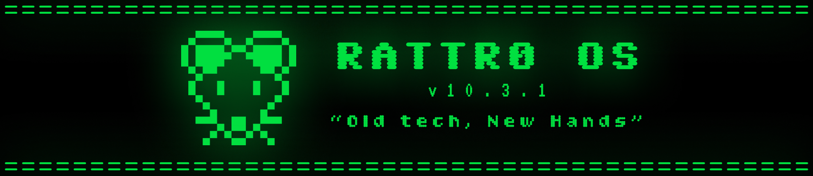
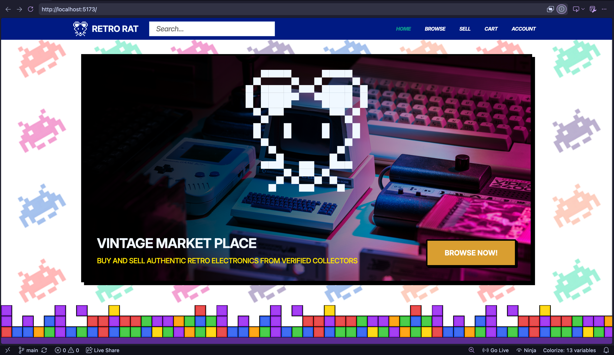
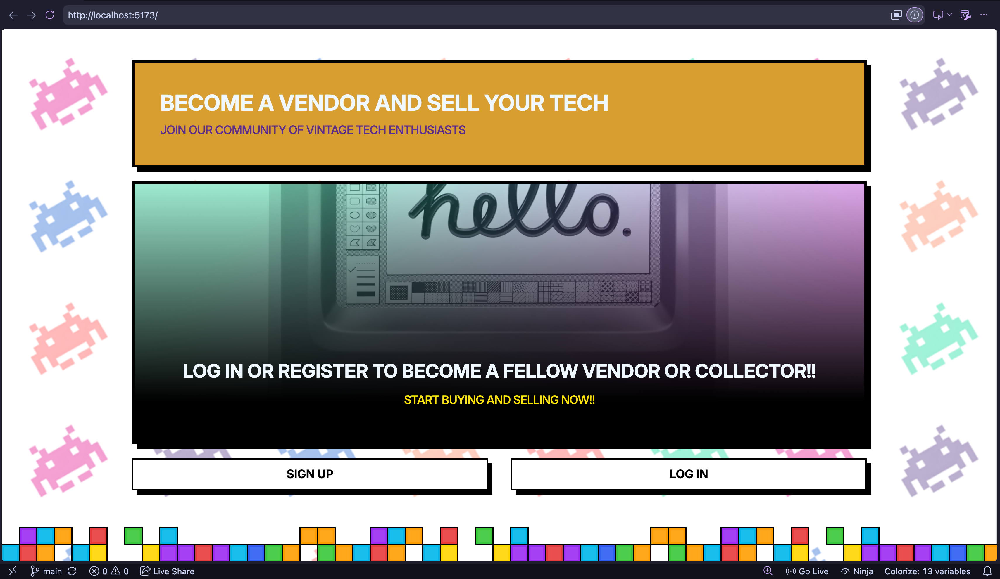
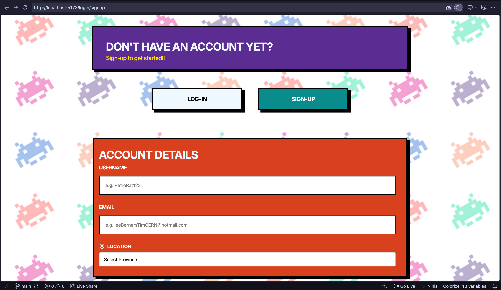
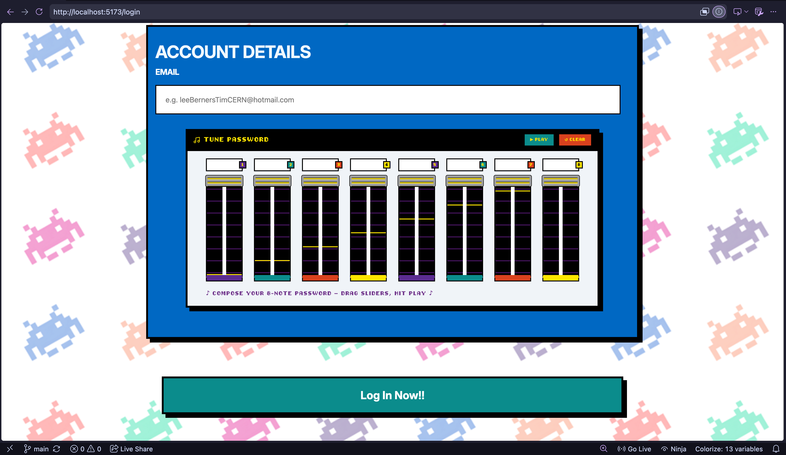
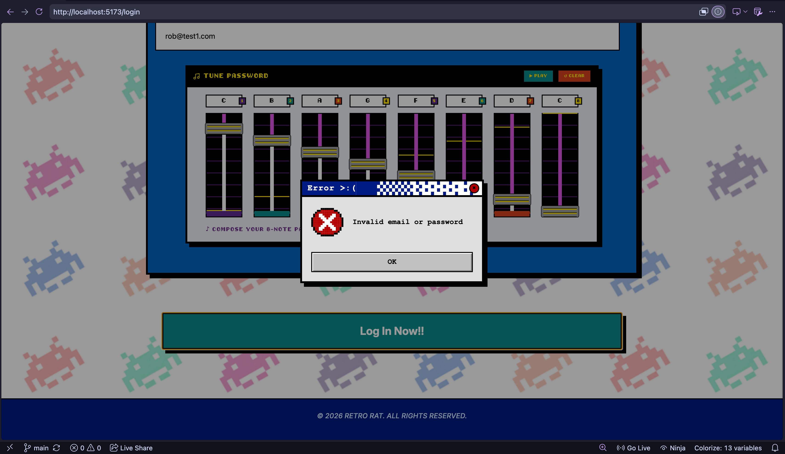
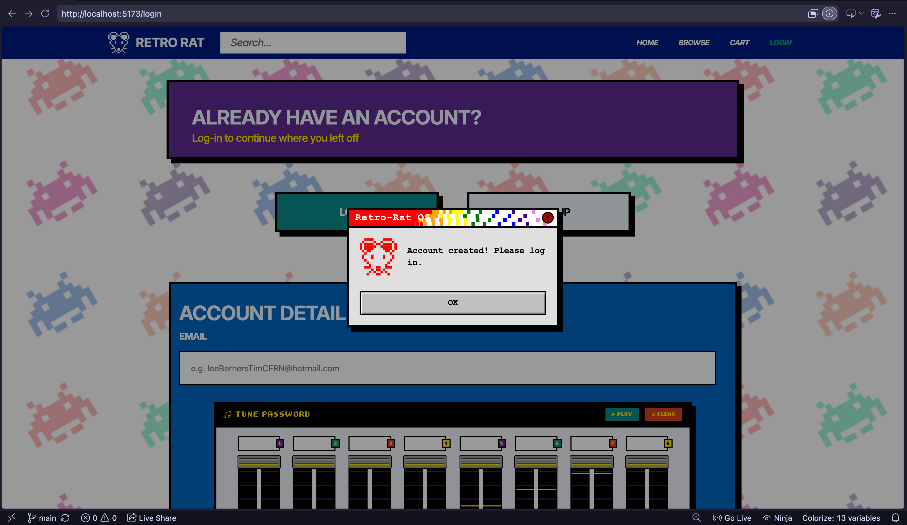
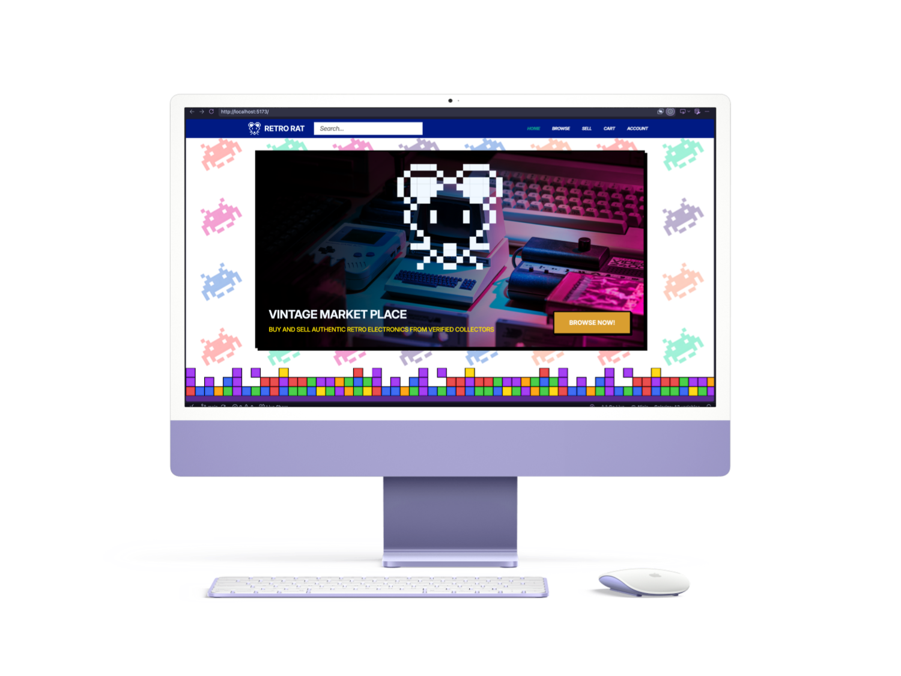
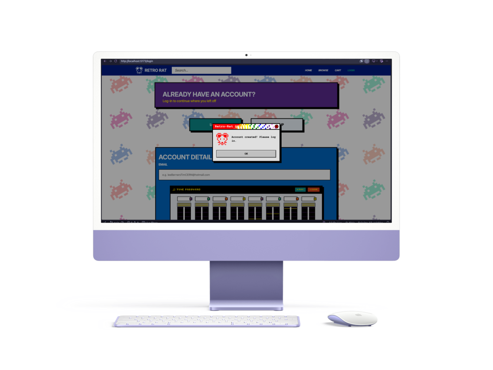
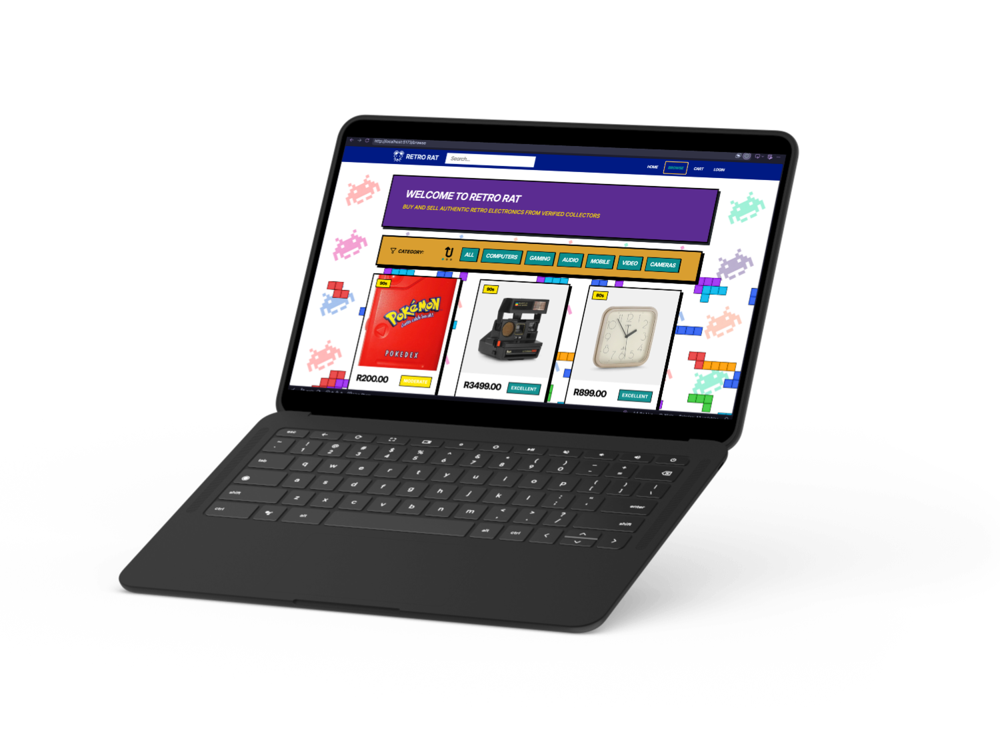

# DVAtors

# 💾 RetroRat: The Ultimate Vintage Tech Time Machine
## Old Tech, New Hands 



> **"Welcome to the grid."** > 
> Did you spend your childhood blowing into cartridges? Do you miss the warm, analogue hiss of a cassette tape? **RetroRat Market** isn't just an e-commerce platform; it's a comeback. We are building the ultimate digital flea market for vintage tech, retro games, and analogue media, all wrapped up in a glorious, pixel-perfect 90s desktop aesthetic.

---

## 🕹️ The Vision: Dialling Up the Past

We aren't just selling nostalgia; we're wrapping you in it. RetroOS Market is a full-stack e-commerce web application designed for collectors, tinkerers, and retro-tech enthusiasts. 



---

## ✨ Radical Features

Users exploring RetroRat will have full access to:

* **💾 The Cyber-Marketplace (Buy & Sell):** A complete storefront flow. Cop that pristine Sony Walkman you’ve been hunting for, or list your own stash of 8-tracks and old-school hardware to make some digital coin.
* **👾 User Profiles (Log On):** Secure authentication so you can manage your active listings, track your sales, and build your retro empire.
* **⭐ Save to Floppy (Wishlist):** See a Sega Genesis you want but need to wait till payday? Save it directly to your personal wishlist.
* **🖨️ The Message Boards (Comments):** Jump into the comment section on any item. Ask the seller about the specs, negotiate, or just geek out over shared nostalgia with the community.
* **🗑️ Drag to Trash:** Changed your mind about selling that old Macintosh? Easily delete and manage your live postings.







---

## 🛠️ Under the Hood (No Dial-Up Required)
[](https://www.mongodb.com)
[](https://expressjs.com)
[](https://react.dev/)
[](https://nodejs.org/en)

[](https://www.javascript.com/)
[](https://getbootstrap.com/)
* **Frontend Engine:** React.js / HTML5 / CSS
* **Backend Mainframe:** Node.js, Express.js
* **Data Storage:** MongoDB
* **Security Protocol:** JSON Web Tokens (JWT) / bcrypt
* **Graphics & Assets:** Custom pixel art, 8-bit icon packs, and retro UI component libraries

---

## 🚀 Boot Sequence (Getting Started)

Ready to run the os? Follow these steps to get a local copy running on your machine.

### System Requirements
* [Node.js](https://nodejs.org/) installed
* [Git](https://git-scm.com/) installed
* A running instance of MongoDB (Local or Atlas)

### Installation Manual

## 1. Clone the repository:
   
bash
```
git clone [https://github.com/remilkies/retro-rat.git](https://github.com/remilkies/retro-rat.git)
```
   
## 2. Access the directory:

Bash
```
cd retro-rat
```

## 3. Install Backend Dependencies:

Bash
```
npm install
```

## 4. Install Frontend Dependencies:

Bash
```
cd retro-rat
```

```
npm install
```

## 5. Configure Environment Variables:
Create a .env file in the root directory and add the necessary config variables.

Code snippet
PORT=5000
MONGO_URI=your_mongodb_connection_string
JWT_SECRET=your_super_secret_key
Execute Application:
Open your terminal in the root directory and run the start command:

Bash
# Boots up both the backend server and frontend client
```
npm run dev 
```

## Mockups





---

## 👾 The Developers (SysAdmins)

### Our Team:

[Troy and Robert] - UI/UX Designers

[Rem] - Frontend Developer A - UI/UX Developer & Core Pages

[Robert] - Frontend Developer B - User Interaction & State

[Troy] - Backend Developer A - API & Database Architect

[Tshedza] - Backend Developer B & Authorisation & Business Logic

### Where to Find Us:

[Rem] - GitHub Profile - remilkies  
[](https://github.com/remilkies)

[Robert] - GitHub Profile - RobertvanEijk-OW-251185  
[](https://github.com/RobertvanEijk-OW-251185)

[Troy] - GitHub Profile - Troy-jsx  
[](https://github.com/Troy-jsx)

[Tshedza] - GitHub Profile - BVLTRA  
[](https://github.com/BVLTRA)

---

[ SYSTEM MESSAGE: It is now safe to turn off your computer. ]

---
